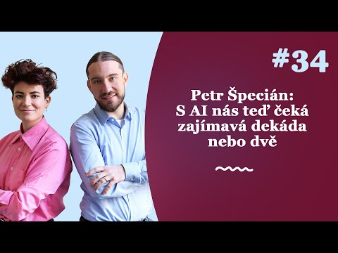
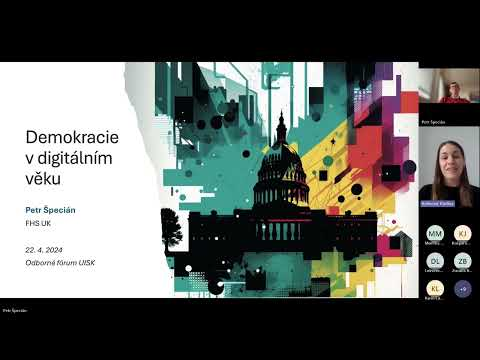
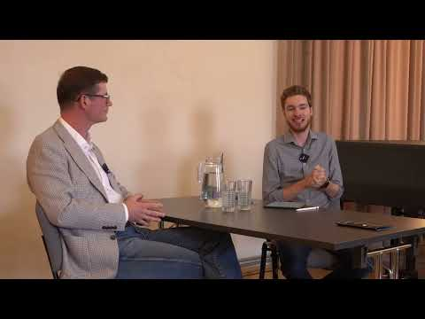
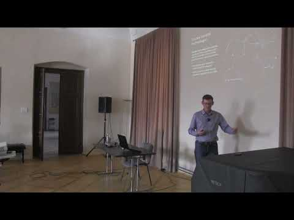
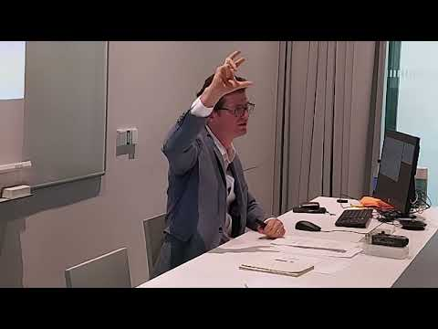
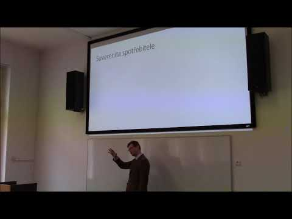

I speak regularly on AI and democracy, the future of universities, and institutional adaptation to technological change, in English and in Czech, for academic and general audiences.

## Recorded talks and podcasts

::: {.video-grid}
```{=html}
<div class="video">
  <a class="video-thumb" href="https://www.youtube.com/watch?v=ppGykCSrCqg" aria-label="Watch on YouTube: AI Institutional Transformation Is on the Way">
    
    <span class="play" aria-hidden="true"></span>
  </a>
  <p class="card-kicker">Podcast · Czech · 2024</p>
  <h3>AI Institutional Transformation Is on the Way</h3>
  <p>Why chatbots deserve a chance alongside human experts, who is responsible for their outputs, and why institutional adoption is likely to continue. Zákulisí sociologie (Youradio Talk).</p>
  <p class="card-link"><a href="https://www.youtube.com/watch?v=ppGykCSrCqg">Watch</a> · <a href="https://open.spotify.com/episode/2xRRX4wSUDSa0Aw7lbOMUu">Listen on Spotify</a></p>
</div>
<div class="video">
  <a class="video-thumb" href="https://www.youtube.com/watch?v=yGGovIy_uT0" aria-label="Watch on YouTube: GenAI-Facilitated Institutional Innovation">
    
    <span class="play" aria-hidden="true"></span>
  </a>
  <p class="card-kicker">Lecture · Czech · 2024</p>
  <h3>GenAI-Facilitated Institutional Innovation</h3>
  <p>How generative AI could help liberal democracies overcome bottlenecks in institutional experimentation. Invited lecture, Institute of Information Studies and Librarianship, Charles University.</p>
  <p class="card-link"><a href="https://www.youtube.com/watch?v=yGGovIy_uT0">Watch</a></p>
</div>
<div class="video">
  <a class="video-thumb" href="https://www.youtube.com/watch?v=FGPvuJr6v1M" aria-label="Watch on YouTube: Expected Social Impacts of AI">
    
    <span class="play" aria-hidden="true"></span>
  </a>
  <p class="card-kicker">Interview · Czech · 2024</p>
  <h3>Expected Social Impacts of AI</h3>
  <p>Technological unemployment, inequality, institutional change, and political life in the digital age. Interview with Jakub Krejčí, Language, Mind, Society Center.</p>
  <p class="card-link"><a href="https://www.youtube.com/watch?v=FGPvuJr6v1M">Watch</a></p>
</div>
<div class="video">
  <a class="video-thumb" href="https://www.youtube.com/watch?v=xrqnDgZLrPg" aria-label="Watch on YouTube: Social Technologies of the Future">
    
    <span class="play" aria-hidden="true"></span>
  </a>
  <p class="card-kicker">Lecture · Czech · 2023</p>
  <h3>Social Technologies of the Future</h3>
  <p>Technology understood broadly, to include institutions such as capitalism and liberal democracy. Summer school lecture, University of Hradec Králové, Broumov.</p>
  <p class="card-link"><a href="https://www.youtube.com/watch?v=xrqnDgZLrPg">Watch</a></p>
</div>
<div class="video">
  <a class="video-thumb" href="https://www.youtube.com/watch?v=PNogZ6i7jqo" aria-label="Watch on YouTube: Democracy in the Digital Age">
    
    <span class="play" aria-hidden="true"></span>
  </a>
  <p class="card-kicker">Lecture · Czech · 2022</p>
  <h3>Democracy in the Digital Age</h3>
  <p>How social-media platforms and digital information environments shape citizens' political views. Být nebo bit? conference, Prague.</p>
  <p class="card-link"><a href="https://www.youtube.com/watch?v=PNogZ6i7jqo">Watch</a></p>
</div>
<div class="video">
  <a class="video-thumb" href="https://www.youtube.com/watch?v=gs88d8d_N8s" aria-label="Watch on YouTube: Consumer and Citizen Sovereignty">
    
    <span class="play" aria-hidden="true"></span>
  </a>
  <p class="card-kicker">Lecture · Czech · 2019</p>
  <h3>Consumer and Citizen Sovereignty</h3>
  <p>Individual normative sovereignty and the value liberal societies attach to people deciding for themselves. Invited lecture, University of Hradec Králové.</p>
  <p class="card-link"><a href="https://www.youtube.com/watch?v=gs88d8d_N8s">Watch</a></p>
</div>
```
:::

## Interviews

::: {.citation-list}
**On the economics of love** (September 2026). Podcast conversation with Honza Vojtko for *Potetovaná duše*, Deník N, on what happens when the tools of economics are turned on intimate relationships: do we enter a relationship the way a firm enters a merger, on the basis of comparative advantage? [Listen](https://denikn.cz/2183941/laska-z-pohledu-ekonomie-maji-vztahy-cenovku/) (Czech, subscription)

**On AI trajectories in Czechia** (April 2025). Interview with Jan Čáp for *Téma* magazine on artificial intelligence in Czechia and prospects for the future; the online version was published by Technet. [Read](https://www.idnes.cz/technet/software/petr-specian-ai-umela-inteligence-budoucnost-vedec-chatbot.A250424_848837_software_krd) (Czech)
:::

## Keynotes and invited lectures

::: {.citation-list}
**"Pravda nebo lež? Jak je libo!" [Truth or Lie? Take Your Pick]** Invited talk (16 July 2026), in Czech. STEM influencer brunch, Prague, Czechia.

**"AI už je tady. Co teď?" [AI Is Here. What Now?]** Opening keynote (16 June 2026), in Czech. [Učím na Ostravské festival](https://alive.osu.cz/festival-ucim-na-ostravske-otevrel-debatu-o-ai-vyuce-i-budoucnosti-vysokych-skol/), University of Ostrava, Czechia.

**"Built for Humans Only? Why AI Adoption in Higher Education Requires a New Deal"** (20 May 2026). POLEMO Seminar, Central European University, Vienna, Austria.

**"Mental Health vs. Artificial Intelligence"** Guest seminar (13 May 2026). Ondřejov Day Psychotherapeutic Sanatorium, Prague, Czechia.

**"Artificial Intelligence and the Future of Democracy: A Scenario Analysis"** Guest lecture (18 November 2025). Faculty of Arts, Charles University, Prague, Czechia.

**"The Purpose of Higher Education in the 21st Century: What Educational Model Do We Need?"** Panel presentation (11 November 2025). Scio, Prague, Czechia.

**"AI at Universities: From an Annoyance to a Basic Right"** Keynote (5 November 2025). [AI 4 Uni](https://prf.ujep.cz/cs/28860/ai-for-uni-program-registrace), Jan Evangelista Purkyně University, Ústí nad Labem, Czechia.

**"Large Language Models in Democratic Society"** Invited lecture (9 September 2024). [AmKon](https://modelkongresu.cz/en/), Plzeň, Czechia.

**"Generative AI and the Future of Tertiary Education"** Keynote (6 September 2024). [Conference on Educational Activities of Universities](https://msmt.gov.cz/vzdelavani/vysoke-skolstvi/dny-vzdelavaci-cinnosti-2024?lang=1), Prague, Czechia.

**"Sustaining People's Rule in the Digital Age"** Invited talk (17 November 2023). Meaning of Democracy Conference, [Polish Academy of Sciences, Scientific Centre in Vienna](https://vienna.pan.pl/), Austria.

**"Democracy in the Digital Age"** Guest lecture (13 October 2022). [Center for Theoretical Study](http://www.cts.cuni.cz/), Czech Academy of Sciences, Prague.

**"Suverenita spotřebitele a občana" [Sovereignty of the Consumer and the Citizen]** Invited lecture (20 February 2019). Centre for the Study of Language, Mind and Society, University of Hradec Králové, Czechia.

**"Economics: From History to Theory and Back"** Invited talk (8 November 2017). Philosophy between Past and Future, Sungkyunkwan University, Seoul, South Korea.
:::

## Conference talks

### 2026

::: {.citation-list}
"Speakers for the Dead: AI Proxies and the Political Economy of Intergenerational Governance" (22 July 2026), with Lucy Císař Brown. European PPE Network Conference 2026, University of Bayreuth, Germany.
:::

### 2025

::: {.citation-list}
"Built for Humans Only: On the Struggles of Institutional AI Adoption" (23 October 2025). [Technology and Sustainable Futures](https://www.mn.uio.no/ifi/english/research/groups/tsf/), University of Oslo, Norway.

"Rethinking the Rules of the Game: Synthetic Data for Institutional Design" (18 September 2025). [17th Biennial INEM Conference](https://inem2025.sciencesconf.org/), Bayreuth, Germany.

"Breaking the Experimentation Bottleneck: Generative Agents As Institutional Design Accelerators" (1 September 2025). [WINIR 2025](https://winir.org/winir-2025/), Prague, Czechia.

"Digital Homunculi: Reimagining Democracy Research with Generative Agents" (17 July 2025). The PPE Society London's First Annual Meeting, London, UK.

"From Slop to Spark: Carving New Institutional Niches for Transformative Ideas" (12 June 2025). Technology and Sustainable Futures, Oslo, Norway.

"AI Oracles: Technological Re-enchantment of the World" (8 February 2025), with Lucy Císař Brown. [What Comes After GenAI?](https://llm4dem.vse.cz/dd2025), Prague, Czechia.
:::

### 2024

::: {.citation-list}
"AI Oracles" (19 September 2024), with Lucy Císař Brown. TEDA'24: The Magic Machine, Through the Prism of Art and Science, University of Cambridge, UK.

"Beyond the Limits: Generative AI and Synthetic Data in Democracy Research" (13 August 2024). [ECPR General Conference 2024](https://ecpr.eu/GeneralConference), Dublin, Ireland.

Author-meets-critics session on *Behavioral Political Economy and Democratic Theory* (31 May 2024). [7th International Conference Economic Philosophy](https://7philoeco.sciencesconf.org/?lang=en), Reims, France.

"Generative AI in the Marketplace for Ideas" (30 May 2024). [7th International Conference Economic Philosophy](https://7philoeco.sciencesconf.org/?lang=en), Reims, France.
:::

### 2023

::: {.citation-list}
"Reimagining Institutions through Generative AI: Navigating the Maze of Institutional Innovation" (28 October 2023). [Computing the Human](https://www.muni.cz/en/events-calendar/u/804408u-computing-the-human-call-for-paper), Brno, Czechia.

"Sociální technologie budoucnosti [Social Technologies of the Future]" (29 September 2023). Summer school, University of Hradec Králové, Broumov, Czechia.

"Democratizing Expertise: The Limits and Possibilities of Artificial Intelligence in Enhancing Democratic Decision-Making" (8 September 2023). ECPR General Conference 2023, Prague, Czechia.

"Large Language Models for Democracy: Limits and Possibilities" (16 June 2023). Technology and Sustainable Development 2023, Østfold University College, Norway.

"LLMs for Democracy" (19 May 2023). [Fortifying Democracy for the Digital Age: Interdisciplinary Perspectives](https://kfil.vse.cz/english/homepage/science-and-research/conferences-and-workshops/fortifying-democracy-for-the-digital-age/), Prague, Czechia.
:::

### 2022

::: {.citation-list}
"Science and Trust in the Digital Age" (22 October 2022). [Scientific Knowledge and Its Public Understanding: Interdisciplinary Perspectives](https://publicunderstandingofscience.weebly.com), Seville, Spain.

"The Specter of Political Irrationality and the Anti-Psychological State" (19 August 2022). Truth and Politics: A Political Epistemology Conference, Bamberg, Germany.

"Democracy and Anthropic Risk" (2 July 2022). Panel "Risks in the Anthropocene", [Green Marble 2022](https://greenmarble2022en.weebly.com), Porto, Portugal.

"Demokracie v digitálním věku [Democracy in the Digital Age]" (3 June 2022). Být nebo bit?, Prague, Czechia.
:::

### 2021

::: {.citation-list}
"The Conceit of Behaviorally Informed Paternalism" (22 October 2021). Perspectives of Paternalism in a Democratic Society, online.

"Oběti či oportunisté? Racionalita ve světle diskuse o dezinformacích [Victims or Opportunists? Rationality in the Light of the Debate on Disinformation]" (30 September 2021). Hradecké filozofické dny, Hradec Králové, Czechia.

"Pandemická epistemologie: Lekce z pandemické krize [Pandemic Epistemology: Lessons from an Epistemic Crisis]" (16 September 2021). XXV. česko-slovenské sympózium o analytickej filozofii, Banská Bystrica, Slovakia.

"Economists in the Democratic Discourse" (25 June 2021). 5th International Economic Philosophy Conference, online.

"Economists in the Democratic Discourse: Between Elitism and Egalitarianism" (20 June 2021). 11th MetaLawEcon Workshop, online.

"Fake News and the Victim Narrative" (7 March 2021). ENPOSS/ANPOSS/POSS-RT 2021 Joint Conference, online.
:::

### 2017–2019

::: {.citation-list}
"The Will to Believe: Demand for Bullshit in a Post-Truth World" (29 November 2019). CaL2019: Cognition and Lying, Brno, Czechia.

"Thou Shalt Not Nudge: Towards an Anti-Psychological State" (21 August 2019). 14th Conference of the International Network for Economic Method, Helsinki, Finland.

"Thou Shalt Not Nudge: Towards an Anti-Psychological State" (7 August 2019). 16th International Congress on Logic, Methodology and Philosophy of Science and Technology, Prague, Czechia.

"Normativity Shifting: Nudging and Sovereignty" (28 June 2018). 4th International Conference Economic Philosophy, Lyon, France.
:::

## Organized conferences and events

::: {.citation-list}
[**What Comes After GenAI? Exploring the Limits of One-Size-Fits-All AI for Democracy and Knowledge**](https://llm4dem.vse.cz/dd2025). Prague University of Economics and Business, 7–8 February 2025. With Mirek Vacura and Eugenia Stamboliev.

**AI Futures Workshop**. Faculty of Social Sciences, Charles University, 2 June 2025. Closed expert workshop on AI development scenarios, with participants from academia, České priority, Effective Altruism Czech Republic, and the Confido Institute.

**Workshop on AI from the Perspective of the Social Sciences and Humanities**. Charles University, November 2023.

[**Fortifying Democracy for the Digital Age: Interdisciplinary Perspectives**](https://kfil.vse.cz/english/homepage/science-and-research/conferences-and-workshops/fortifying-democracy-for-the-digital-age/). International conference, Prague University of Economics and Business, 18–20 May 2023.

**Perspectives of Paternalism in a Democratic Society**. International conference, online, 22–23 October 2021.

**Současná filosofie vědy [The Current Philosophy of Science]**. Prague University of Economics and Business, 14 September 2018.

Member of the organizing committee, [The Society for Cognitive Science and Philosophy](http://www.cognitivescience.cz), 2012–2019.
:::
